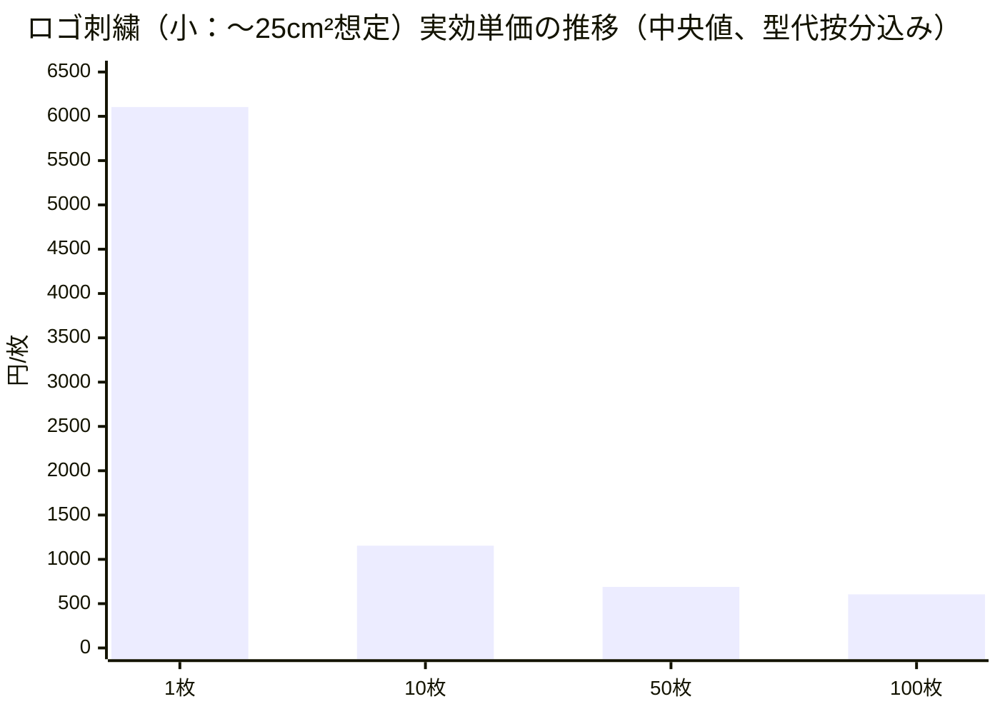

# 刺繍の料金相場レポート

## エグゼクティブサマリー

本調査は、**2026-02-13（日本時間）**に、日本語の一次情報（主に公式サイトの料金表）から、刺繍料金の「相場」を**種類別・数量別・算出基準別**に整理し、中央値・最頻値・幅（レンジ）を算出した。価格は各社で定義（面積・縦横・ステッチ数・色数・税表記）が異なるため、**「加工代（1枚あたり）」と「初回費（型代/データ作成）」を分離**し、必要に応じて税込換算（税別→×1.1）を行った。citeturn19view0turn25view0turn24view0turn37view0turn18view0turn32view0

刺繍の大枠の相場感は次の通りである（いずれも**刺繍加工代のみ**が中心。別途「型代」等が発生し得る）。  
- **ネーム刺繍（既成書体・文字のみ）**：1枚の小ロットでは概ね**330〜1,320円/枚**、10枚で**250〜660円/枚**、50枚で**190〜660円/枚**、100枚で**約300〜550円/枚**の観測例があり、数量増で単価が下がる傾向が明確である。citeturn25view0turn29view0turn27view0turn11view0turn18view0turn34view0  
- **ロゴ刺繍（ワンポイント〜小ロゴ相当：〜25cm²級）**：加工代は、1枚で**500〜1,760円/枚**、10枚で**450〜1,100円/枚**、50枚で**550〜880円/枚**、100枚で**488〜770円/枚**（いずれも税込相当で統一した観測例）。citeturn25view0turn29view0turn37view0turn19view0turn3view0turn28view0turn36search0turn0search9  
- **刺繍ワッペン（パッチ）**：サイズ・色数・土台・取り付け方式で単価が大きく変動する。例えば**5×5cm**では10〜29枚で**670円/枚**、50〜99枚で**560円/枚**（いずれも税込、3色まで）という公式価格表がある一方、別業者では同等面積でより高い価格帯も提示される。citeturn32view0turn36search0  
- **背中サイズ/大判（フルカバレッジ寄り）**：たとえば背中 **H20×W28cm**で10〜19枚**4,400円/枚**、**34×40cm以内**で**4,950円/枚**など、数千円/枚のレンジが中心。ただし「型代」が大きく、色数・塗りつぶし量で見積化しやすい。citeturn37view0turn35view0  
- **初回費（型代/刺繍データ作成）**：小ロゴでも**2,000〜6,600円級**の例が多い一方、デザインが複雑/大判になると**7,700円、11,000円、13,200円、20,000円超**など広い（ステッチ数連動で3万針まで段階表を示す例もある）。citeturn25view0turn19view0turn37view0turn35view0turn18view0turn36search0  
- **追加費用**は「持ち込み手数料（例：加工賃の30%増）」「特急（例：+220円/枚、または通常×1.8）」「色数追加（例：+30円/枚、6色目以降+100円/枚など）」「送料（例：16,500円未満は全国一律880円）」などが明示されており、**本体価格以外の上振れ要因**になりやすい。citeturn25view0turn24view0turn11view0turn19view0turn28view0  

## 調査範囲と方法

調査日は**2026-02-13（JST）**で、料金表は原則として公式サイトの該当ページから抽出した（取得日も同日）。citeturn19view0turn25view0turn24view0turn32view0turn37view0turn18view0turn28view0turn23view0turn27view0turn3view0turn21search0  

刺繍料金は各社で算出基準が異なるため、本レポートでは以下の共通フレームに正規化した。  
- **加工代（単価）**：原則「1箇所・1枚あたり」の刺繍代。例として、サイズ・枚数・色数で段階表を提示する方式（胸5×5、10〜19枚など）がある。citeturn37view0turn25view0turn29view0turn23view0turn32view0turn24view0  
- **初回費（型代/パンチデータ/刺繍データ作成）**：オリジナルロゴ等は初回に必要、既成書体のネーム刺繍は不要なケースが多い。citeturn25view0turn27view0turn36search0turn35view0turn18view0  
- **税表記**：税込/税別/記載なしが混在するため、統計（中央値等）は可能な範囲で「税込相当」に揃えた（税別は×1.1換算）。税表記が不明なものは統計母集団から除外し、参考値として別掲した。citeturn29view0turn25view0turn37view0turn19view0turn11view0turn0search9turn28view0  

image_group{"layout":"carousel","aspect_ratio":"16:9","query":["embroidered patch on jacket close up","name embroidery on uniform chest","cap logo embroidery front panel","large back embroidery jacket"],"num_per_query":1}

## 種類別・数量別の料金一覧

### 種類別・数量別の相場サマリー

下表は、同一条件が完全一致しない複数の公式料金表を「代表条件」に合わせて統合し、**加工代（単価）**の**中央値・最頻値・幅（最小〜最大）**を示す（統計母集団は各セルで異なる）。主要な根拠は、ネーム刺繍の数量別表、ロゴ刺繍（胸・袖）サイズ別表、面積別の段階表、背中サイズ価格表など。citeturn25view0turn29view0turn27view0turn11view0turn37view0turn19view0turn35view0turn23view0turn32view0turn3view0turn28view0turn36search0turn18view0  

| 刺繍の種類（代表条件） | 1枚（中央値 / 最頻値 / 幅） | 10枚（中央値 / 最頻値 / 幅） | 50枚（中央値 / 最頻値 / 幅） | 100枚（中央値 / 最頻値 / 幅） |
|---|---:|---:|---:|---:|
| ネーム刺繍（文字のみ、H約1.3〜1.5cm級・1行相当、既成書体中心） | **525円 / なし / 330〜1,320円** | **500円 / 660円 / 250〜660円** | **350円 / なし / 190〜660円** | **308円 / なし / 300〜550円** |
| ロゴ刺繍（小：〜25cm²級、胸・袖相当、3色程度・塗りつぶし少なめ想定） | **605円 / 550円 / 500〜1,760円** | **604円 / 550円・1,100円 / 450〜1,100円** | **579円 / 550円 / 550〜880円** | **550円 / 550円 / 488〜770円** |
| ワッペン/パッチ（刺繍ワッペン、5×5cm級、3色まで想定） | 未指定（最低枚数がある業者が存在） | 参考例の中心：**670円/枚**（10〜29枚） | 参考例の中心：**560円/枚**（50〜99枚） | 多くが見積（ただし100枚の最安例提示あり） |

ネーム刺繍の「幅」が広いのは、**個人名（単独加工）・共通文字（他加工同時）・会社名/チーム名（文字数増）**など、前提が異なる公式表を統合しているためである。たとえば、単独でネーム（個人名）を入れる場合は高く、他の加工と同時依頼だと大幅に下がる価格表がある。citeturn37view0turn11view0turn25view0turn29view0turn27view0turn34view0  

### 種類別・数量別の詳細テーブル

ロゴ刺繍（直接刺繍）の代表的な料金表は、**「縦横サイズ」×「枚数」**、または**「面積（cm²）」×「枚数」**で整理される。例えば、胸5×5cm内の枚数別、面積25cm²内の枚数別、縦横合計（例：縦5×横3＝15）で区分する方式などがある。citeturn37view0turn36search0turn24view0turn25view0turn29view0  

| サイズ・算出軸（例） | 1〜9枚 | 10〜29枚 | 30〜49枚 | 50〜99枚 | 100枚以上 |
|---|---:|---:|---:|---:|---:|
| 胸 5×5cm以内（糸色3色まで・塗りつぶしなし、税込） | 1,760円 | 1,100円（10〜19） | 880円（30〜49） | 見積（50〜） | 見積 |
| 25cm²以内・直接刺繍（枚数別、税込） | 660円（1〜9） | 600円 | 550円（30〜） | — | — |
| 30cm²以内（オリジナル刺繍/ワッペン、税込） | 500円 | 450円 | 400円（30〜） | 見積（50〜さらに割引） | 見積 |
| 10〜30「cm²未満」（縦×横の“合計”で区分、3色まで） | 550円 | 490円 | 460円 | 420円 | 見積（表中は要見積） |

上表・サマリーにおける「ロゴ刺繍（小）」は、このような複数の料金体系を**〜25cm²級**へ寄せて統合したものである。citeturn37view0turn36search0turn25view0turn24view0  

ワッペン（刺繍ワッペン）の公式表は、**サイズ別（3×3、5×5、7×7、10×10など）×数量**で提示される例が多い。以下は、3色までの価格表の一例である。citeturn32view0  

| 刺繍ワッペン（3色まで、税込） | 型代（初回） | 10〜29枚（単価） | 30〜49枚（単価） | 50〜99枚（単価） | 100枚以上 |
|---|---:|---:|---:|---:|---|
| 3×3cm | 6,600円 | 510円 | 470円 | 400円 | 見積 |
| 5×5cm | 6,600円 | 670円 | 630円 | 560円 | 見積 |
| 7×7cm | 6,600円 | 830円 | 790円 | 720円 | 見積 |
| 10×10cm | 8,800円 | 1,070円 | 1,030円 | 960円 | 見積 |

この例では、**ワッペンは「5枚以上から受付」**と明記されているため、厳密には「1枚」の単価が定義されない（小ロット不可）点に注意が必要である。citeturn32view0  

背中など大判（フルカバレッジ寄り）は、**サイズが大きいほど単価も初回型代も上がる**傾向が強い。例えば背中サイズで、**H20×W28cmで10〜19枚4,400円/枚**、別の料金体系では**34×40cm以内で4,950円/枚**（いずれも税込）が示されている。citeturn37view0turn35view0  

## 単価の算出基準と追加費用

### 見積りの基本式

多くの公式説明を総合すると、刺繍料金は概ね次の構造に分解できる（業者により項目名・含有範囲は異なる）。citeturn29view0turn25view0turn24view0turn19view0turn18view0turn36search0turn37view0  

- **合計費用 ≒（刺繍加工代 × 枚数）＋ 初回費（型代/データ作成）＋ 追加費用（色/素材/持ち込み/急ぎ/梱包/送料 等）** citeturn29view0turn25view0turn24view0turn19view0  

単価の主要な算出基準は、公式の料金表から次の類型に整理できる。  
- **サイズ（縦×横）**：例として「胸5×5cm」「背中H20×W28cm」など、縦横の枠で価格帯を作る方式。citeturn37view0turn23view0turn19view0turn35view0turn29view0  
- **面積（cm²）**：25cm²、50cm²、100cm²、200cm²など段階表。citeturn36search0turn28view0turn3view0turn25view0  
- **ステッチ数**：針数（〜3000針、3001〜6000針…）と枚数で「型作成料」「刺繍代金目安」を示す方式。citeturn18view0  
- **色数**：3色まで同価格、4色目から+50円/枚、6色目以降+100円/枚などの加算方式が複数見られる。citeturn32view0turn24view0turn25view0turn28view0turn19view0turn16search3turn35view0  
- **最小ロット**：ワッペンは「5枚以上から受付」など、カテゴリ自体に最低枚数を置く例がある一方、直接刺繍やネーム刺繍は1枚からの表を持つ例も多い。citeturn32view0turn25view0turn29view0turn37view0turn36search0  

### 主要な追加費用の一覧と目安

追加費用は「初回のみ」「条件付き」「都度見積」が混在する。一次情報で明示されている代表例を、項目別に整理した。citeturn19view0turn25view0turn24view0turn32view0turn27view0turn28view0turn21search0turn11view0turn37view0turn18view0  

| 追加費用カテゴリ | 明示価格の例（目安） | 備考 |
|---|---:|---|
| 型代/刺繍データ作成（初回） | 2,000〜13,200円級（複雑度A〜D）／11,000円（背中大）／ステッチ数に応じ最大40,000円（型作成） | デザイン刺繍で発生しやすい。既成書体のネーム刺繍は不要な場合が多い。citeturn37view0turn35view0turn18view0turn36search0turn25view0turn19view0turn27view0 |
| 版下校正/データ起こし | 8,800円（手書きからの版下校正）／デザイン制作 2,750円〜 | ラフ・手書き・画像のみ入稿で発生しやすい。citeturn19view0turn25view0turn24view0turn23view0turn21search0 |
| 糸色追加（同一箇所） | +30円/枚（4色目以降）／+50円/枚（5色目以降）／6色目以降+100円/枚(税抜) | 「何色まで同額か」が業者ごとに異なる。citeturn25view0turn24view0turn35view0turn32view0turn28view0turn16search3 |
| 刺繍色指定（既定色以外） | 1,100円/色 | “指定色以外”を別課金する方式。citeturn24view0turn25view0turn19view0 |
| 持ち込み手数料（アイテム支給） | 加工賃の30%増／×1.2（持ち込み時） | 持ち込みそのものに制限がある例もある。citeturn25view0turn24view0turn11view0 |
| 納期短縮（特急） | +220円/枚（10枚以下は一律2,200円）／通常料金×1.8（3日後渡し）／1着+1,100円（短縮） | “対応可否は時期による”注意書きが多い。citeturn25view0turn11view0turn19view0turn24view0 |
| 送料 | 16,500円未満：全国一律880円（沖縄除く） | 送料無料条件が別にある場合もある。citeturn24view0turn19view0turn36search2 |
| ワッペン取り付け（縫付/ベルクロ等） | 安全ピン110円、ベルクロ330円、縫付330円／別の例で縫付550円 | “ワッペン単体”と“衣類へ取付”を分けるのが一般的。citeturn32view0turn37view0turn25view0 |
| 仕上げ/袋入れ等 | 仕上げ代66〜275円/枚／たたみ袋入れ40円/枚 | 梱包・袋出し・ネームタグ付け等を含む場合がある。citeturn27view0turn25view0turn24view0turn11view0 |
| 刺繍枠代（セッティング料） | 枠代/回 440〜1,650円（枠サイズ別） | これは“工房のセルフ利用”の料金体系で、委託加工とは別カテゴリ。citeturn21search0 |

## 素材・アイテム別の注意点と価格差、地域差とオンライン比較

素材・アイテム別の価格差は、一次情報上は主に「**追加料金（アップチャージ）**」として表れる。代表的には、**キャップ**や**重防寒着**、**道着・帯**などが追加対象になりやすい（機材・治具・下打ち等の手間が増えるため）。citeturn24view0turn23view0turn19view0turn11view0  

具体例として、素材/アイテム別の差分が明示された料金表では、以下が確認できる。  
- キャップは「通常料金×1.1」や「価格に+330円」など、**割増**として表現される。citeturn11view0turn23view0  
- 重防寒着は「+330円」、道着・帯は「+550円」等の素材別アップチャージが記載されている。citeturn24view0  
- ネーム刺繍でも、アイテムにより「仕上げ代（66〜275円/枚）」が発生する例がある。citeturn27view0  
- 背中・大判は、単価自体が数千円/枚に上がり、型代も大きくなりやすい。citeturn37view0turn35view0  

地域差については、主要都市の“地価・人件費”差よりも、一次情報からはむしろ**事業モデル差**（オンライン一括処理、デザイン制作を有償化、実店舗で相談を前提化等）が支配的である。たとえば、価格構成を「デザイン料金＋版代＋商品代＋刺繍代＋オプション」として明示している例があり、この設計思想はオンラインの「自動見積・定型化」と対照的である。citeturn23view0turn24view0turn19view0turn36search0  

主要都市別に、公開料金表から“比較可能な範囲”で抜粋した参考例（同一条件ではないため傾向を見る目的）を示す。citeturn19view0turn29view0turn23view0turn36search0turn6search5  

| 都市（参考） | 例に用いた事業者（ID） | 参考となる明示価格の例 |
|---|---|---|
| entity["city","東京","japan"] | A / B / C | 小ロゴ3×3 550円・型代5,500円、ネーム刺繍は約1週間など（オンライン型）citeturn19view0turn25view0turn24view0 |
| entity["city","大阪","japan"] | E / F | ネーム刺繍（幅10cm・H1.5cm以内）1枚770円〜、税別の文字刺繍表・特急×1.8など（実店舗/相談型を含む）citeturn29view0turn11view0 |
| entity["city","名古屋","japan"] | G | 価格構成（デザイン料金＋版代…）を明示、刺繍代は縦横の組合せで880円〜、帽子は+330円などciteturn23view0 |
| entity["city","福岡","japan"] | — | ネーム刺繍の文字数・フォント別価格を持つ業態の存在（例：会社名のみ330円等）citeturn8search1 |
| entity["city","札幌","japan"] | H | 納期は通常2〜3週間、デザイン刺繍は面積×枚数、データ作成2,000〜5,000円など（価格表型）citeturn36search0 |

結論として、地域差は“都市そのものの差”というより、「**相談・デザイン制作の有償化**」「**持ち込み可否**」「**短納期サービス設計**」などの違いとして現れ、同一都市内でも価格帯は重なり合う可能性が高い。citeturn23view0turn24view0turn19view0turn11view0turn36search0  

## 主要業者の比較、数量別単価推移、情報源リスト

### 主要業者の比較表

下表は、料金表が比較的明確に公開されている主要事業者を中心に、**代表価格・最小ロット・納期（明記がある場合）**を整理した（URLは要求に従い明記）。citeturn19view0turn25view0turn24view0turn32view0turn37view0turn18view0turn28view0turn23view0turn27view0turn3view0turn36search0turn11view0  

| ID | 事業者 | 代表的な明示価格（例） | 最小ロット（明記） | 納期（明記） | URL |
|---|---|---|---|---|---|
| A | entity["company","東京ユニフォーム","uniform supplier japan"] | 小ロゴ3×3：550円/枚、型代5,500円、急ぎ便+1,100円/着 | 1枚（料金表が1枚基準） | 刺繍確定後 最短約14日出荷、ネーム刺繍は約1週間 | `https://www.tokyouniform.com/shop/esthedepot/about-processing/embroidery-original.php` |
| B | entity["company","プリント刺繍工房","embroidery service japan"] | オリジナル刺繍30cm²：10枚〜450円/枚、型代4,400円 | 1枚（価格表あり） | 特急：4営業日以内発送 +220円/枚 | `https://www.printshisyu.com/guide_shisyu.html` |
| C | entity["company","マーキングラボ","printing and embroidery japan"] | 10〜30区分：10〜29枚 490円（3色まで）、型代 4,400〜 | 1〜9枚区分あり | 特急：4営業日以内発送 +220円/枚 | `https://www.marking-lab.com/kakou_original_emb.html` |
| D | entity["company","カメオカ","custom wear japan"] | 刺繍ワッペン5×5：10〜29枚 670円/枚、型代6,600円 | ワッペン：5枚以上 | 最短2営業日（サイト上の表記） | `https://www.yu-kameoka.com/user_data/list_wappen_cgy2` |
| E | entity["company","アトムプリント","custom t-shirt osaka"] | ネーム刺繍（幅10cm）：1枚770円、10枚451円、100枚308円（各税込） | 1枚区分あり | 未指定 | `https://www.atom-print.com/price_embroidery/` |
| F | entity["company","有限会社 林ネーム刺繍店","osaka embroidery shop"] | 個人名（姓のみ）500円（税別）、特急×1.8、帽子・バッグ×1.1 | 1〜の区分あり | 特急：3日後渡し（通常×1.8） | `https://shisyuya.jp/price-list/` |
| G | entity["company","Three RAD","nagoya original goods"] | 刺繍代：縦横表で880〜2,200円/枚（帽子は+330円）、版代6,600円〜 | 1枚（商品代や刺繍代が1枚基準） | 未指定 | `https://threerad.com/price_embroidery` |
| H | entity["company","株式会社ナッティ企画","sapporo custom apparel"] | 25cm²：10〜29枚 600円/枚、データ作成2,000〜5,000円、ネーム430〜 | 1枚（表記） | 通常2〜3週間 | `https://nuty-planning.com/print/embroidery/index.html` |
| I | entity["company","オリジナルプリント.jp","custom printing japan"] | 20cm²：10〜29枚 607円/枚（他にデータ代あり）、出荷目安5営業日〜 | 10枚未満に独自価格帯 | 出荷目安 5営業日〜 | `https://originalprint.jp/store.php/major2/embroidery` |
| J | entity["company","フォーカス","clat-japan operator"] | デザイン刺繍25cm²：+500円/個（税抜）、200cm²：+5,500円/個 | 未指定 | 最短2日後発送（特急料金なしの表記） | `https://www.forcus.co.jp/bag_campaign/emb` |
| K | entity["company","MEDICAL WEAR MAGIC","medical uniform japan"] | 胸5×5：10〜19枚 1,100円/枚、型代（A）5,500円〜（税込） | 1枚区分あり | 50枚以上は別途見積 | `https://medicalwearmagic.jp/contents/price.html` |
| L | entity["company","有限会社 タカタエンブレム","embroidery emblem hirakata"] | 針数×枚数で単価レンジ、型作成も針数×枚数で段階 | 1〜の区分あり | 未指定 | `https://takataemblem.com/price-list/` |

### 数量別単価推移のグラフ

ロゴ刺繍（小：〜25cm²級）の「実効単価（中央値）」を、**加工代の中央値 + 型代の代表値5,500円を枚数按分**として算出した。加工代は、複数の料金表（サイズ別、面積別、枚数別）から税込相当で統合し、型代は複雑度A等で5,500円級が明示される例を参照している。citeturn25view0turn19view0turn37view0turn35view0turn36search0turn14view0turn24view0turn18view0  

このグラフが示す通り、小ロット（1枚）では**型代の按分負担が支配的**になり、10枚でも依然として型代が単価を押し上げる。一方で50〜100枚になると、型代按分は100円/枚未満に収束し、**加工代そのもの（500〜800円帯の競争領域）**が中心になる。citeturn25view0turn37view0turn19view0turn36search0  

### 情報源リスト（取得日：2026-02-13 JST）

以下は本レポートで参照した一次情報（中心）である。事業者名は上表のIDと対応させ、ここでは重複を避けるためIDで記載する。citeturn19view0turn25view0turn24view0turn32view0turn37view0turn18view0turn28view0turn23view0turn27view0turn3view0turn36search0turn21search0turn11view0  

- A：`https://www.tokyouniform.com/shop/esthedepot/about-processing/embroidery-original.php`  
- B：`https://www.printshisyu.com/guide_shisyu.html`  
- C：`https://www.marking-lab.com/kakou_original_emb.html`  
- D：`https://www.yu-kameoka.com/user_data/list_wappen_cgy2`、`https://www.yu-kameoka.com/user_data/embroidery3`  
- E：`https://www.atom-print.com/price_embroidery/`  
- F：`https://shisyuya.jp/price-list/`  
- G：`https://threerad.com/price_embroidery`  
- H：`https://nuty-planning.com/print/embroidery/index.html`  
- I：`https://originalprint.jp/store.php/major2/embroidery`  
- J：`https://www.forcus.co.jp/bag_campaign/emb`、`https://www.forcus.co.jp/print/embroidery.html`  
- K：`https://medicalwearmagic.jp/contents/price.html`  
- L：`https://takataemblem.com/price-list/`  
- 刺繍枠代（工房セルフ利用の参考例）：`https://koubou.fujikake21.co.jp/service/machine/embroidery`